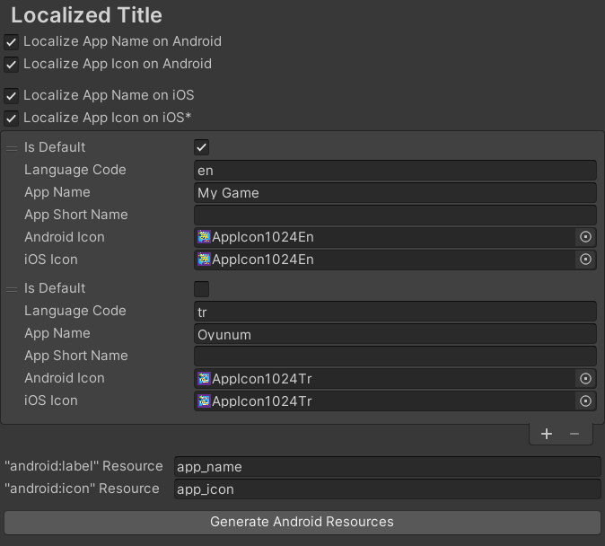

# Unity Localized App Title

**Discord:** https://discord.gg/UJJt549AaV

**[Support the Developer ☕](https://yasirkula.itch.io/unity3d)**

This plugin helps you localize your app's name and/or icon on Android & iOS. Note that the icon doesn't automatically change with the device language on iOS but it's possible to change it at runtime via scripting API.

## INSTALLATION

There are 4 ways to install this plugin:

- import [LocalizedAppTitle.unitypackage](https://github.com/yasirkula/UnityMobileLocalizedAppTitle/releases) via *Assets-Import Package*
- clone/[download](https://github.com/yasirkula/UnityMobileLocalizedAppTitle/archive/master.zip) this repository and move the *Plugins* folder to your Unity project's *Assets* folder
- *(via Package Manager)* add the following line to *Packages/manifest.json*:
  - `"com.yasirkula.localizedapptitle": "https://github.com/yasirkula/UnityMobileLocalizedAppTitle.git",`
- *(via [OpenUPM](https://openupm.com))* after installing [openupm-cli](https://github.com/openupm/openupm-cli), run the following command:
  - `openupm add com.yasirkula.localizedapptitle`

## LICENSE

Localized App Title is licensed under the [MIT License](LICENSE). Please note that this asset uses [AppIconChangerUnity](https://github.com/kyubuns/AppIconChangerUnity) and [zipstorer](https://github.com/jaime-olivares/zipstorer) assets which are also licensed under the MIT License. See [ThirdPartyNotices.txt](../Plugins/LocalizedAppTitle/ThirdPartyNotices.txt) in the package for more details.

## HOW TO

Simply open **Project Settings/Player/Localized Title** page (on older versions, it's located at **Preferences/Localized App Title**) and tweak the settings as you wish:

- the default language will be used when none of the provided localizations match the device's language and on iOS, the default language's icon will be used by default
- for Android support, **Language Code** mustn't include language sub-code (i.e. use `en` instead of `en-US`)
- on Android, after all values are set, you must click the **Generate Android Resources** button at the bottom (when a setting is changed, repeat the process)
- on iOS, it's unclear where **App Short Name** is used or whether or not it's used at all. It corresponds to `CFBundleName` and its value can be left empty
- In *Player Settings*, if you provide custom icons for *Adaptive icons*, *Round icons*, *Spotlight icons*, *Settings icons* and etc., these icons will probably not be localized. So you should either not localize the app icon or clear these custom icons

## SCRIPTING API

**NOTE:** These functions have no effect on Android.

`void LocalizedAppTitle.SetLanguage( string languageCode )`: changes the app's icon to the specified language's icon (pass *null* to revert to the default language's icon). Note that Apple may reject your app if you call this function without user input or you don't provide a way to revert to the default icon (for the latter case, passing *null* instead of the default language's *Language Code* might be sufficient).

`string LocalizedAppTitle.GetLanguage()`: returns the current icon's "Language Code" or null if the default icon is used

`bool LocalizedAppTitle.SupportsSettingLanguage()`: returns *true* if *SetLanguage* and *GetLanguage* functions are supported (iOS 10.3 or later)
